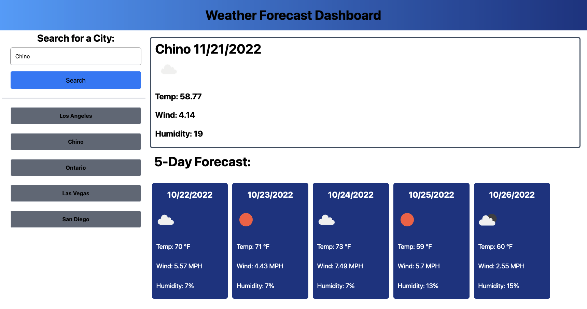

<h1 align='center' >Weather Forecast Dashboard</h1>

---

### Objective

The purpose of my Weather Forecast Dashboard project is to utilize the recently learned skills in obtaining and using third party APIs. How to deep dive into a particular API and extract all the relevant information needed to create a weather forecast application.

The end result was a functioning weather forecast application that is able to fetch the current and futre weather conditions of a specified city and dynanically display the results into a beautiful formatted HTML layout.

---

### Third party API

OpenWeatherMap is the server side API that was used obtain all of the relevant weather information needed to create a weather forecast application. With the knowledge of how arrays and objects function, I was able to locate all of the relevant weather information needed to create a weather forecast application.

Two APIs from OpenWeatherMap were actually implemented. The first API was to fetch the coordinates of the cities.

##### Geocoding API

> http://api.openweathermap.org/geo/1.0/direct?q={city name},{state code},{country code}&limit={limit}&appid={API key}

The second API used the coordinates obtained by the first API to retrieve the weather information for whatever city the user inputs.

##### Current/Forecast Weather API

> https://api.openweathermap.org/data/3.0/onecall?lat={lat}&lon={lon}&exclude={part}&appid={API key}

---

Below is a screenshot of the weather application in action displaying the current weather of the inputted city as well as the 5 day forecast of that city. The dynamically added search history is also displayed which are clickable to redisplay a previously searched ctiy.

---

## LINKS

> - Deployed application:

> - Github repository:
